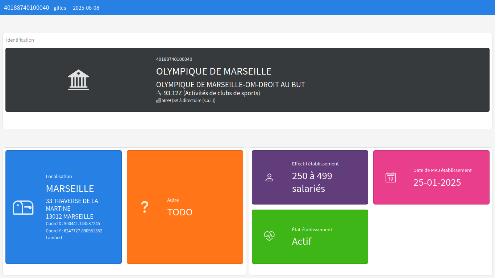

```{r, include = FALSE}
knitr::opts_chunk$set(
  collapse = TRUE,
  comment = "#>"
)
```

## Faire des requêtes simples avec `apisirene`

Il est possible de faire différent types de requêtes *via* l'API Sirene :

1. Des requêtes sur SIREN

2. Des requetes sur SIRET

3. Des requêtes multicritères

4. Des requêtes sur liens de succession entre établissements

## Requetes simples sur SIREN

```{r}
library("apisirene")

"383 474 814" |> 
	insee_get_siren() |> 
	purrr::pluck("unitesLegales") |> 
	knitr::kable()
```

## Requetes simples sur SIRET

```{r}
"58204194300405" |> 
	insee_get_siret_all() |> 
	insee_parse_siret_resp() |> 
	knitr::kable()
```

## Présentation des résultats

Pour les requêtes sur SIRET, il est possible de présenter les résultats sous forme de *dashboard* dans un navigateur web.

```{r dashboard, eval=FALSE}
"40188740100040" |> 
	insee_utils_make_report()
```

{ width=90% }

